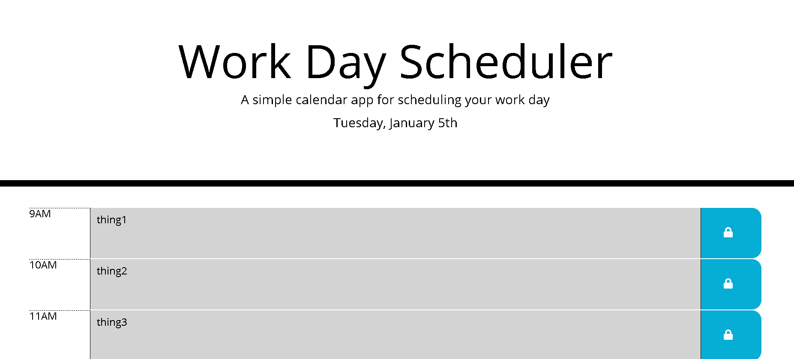

# Work-Day-Scheduler
application: https://jmerges.github.io/Work-Day-Scheduler/  
 
James Merges  
email: jamesmerges1@gmail.com  
github: https://github.com/jmerges  
linkedin: https://www.linkedin.com/in/james-merges-b938401b7/  
 
## Description
This application is a nice little workday calender that will save your activities for the day and display the current hour. The past and future hours are highlighted in gray and green, respectively. On a new day, the activities are cleared.
 
## Tools Used
A CSS/html basic page structure was provided by UCB Bootcamp. I used javascript and Bootstrap to dynamically generate the time rows and populate them with local storage data.
 
## Preview

